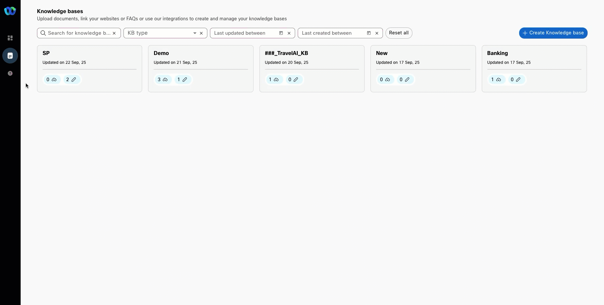
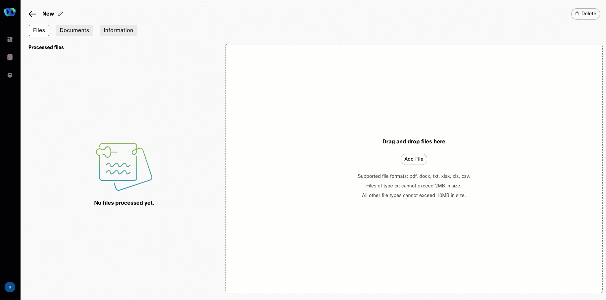
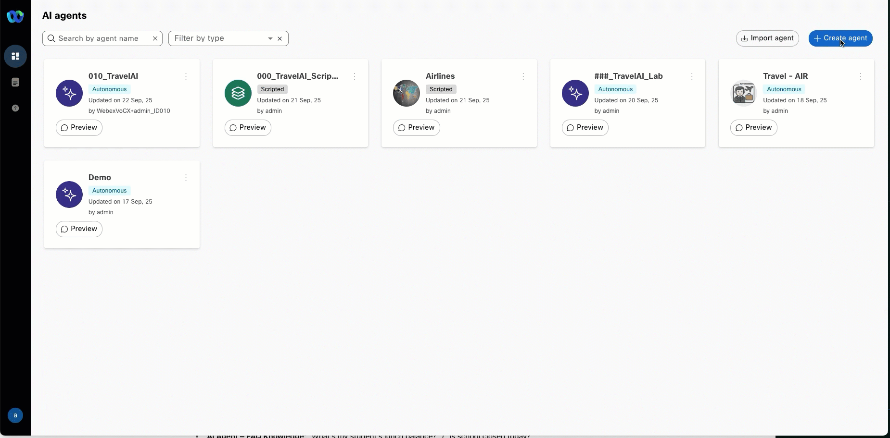
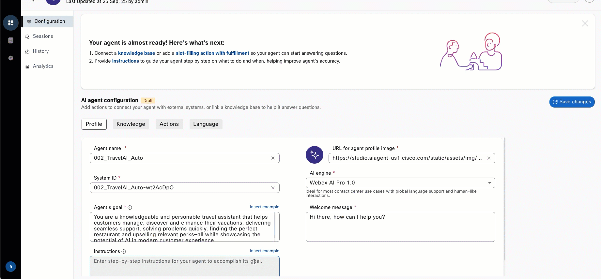
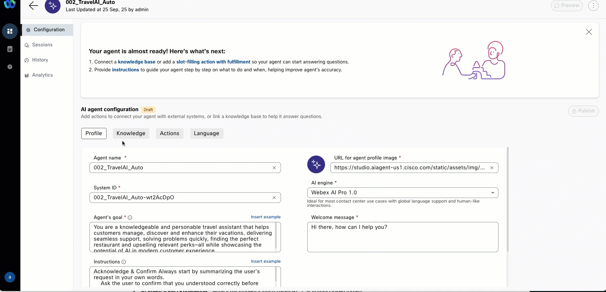
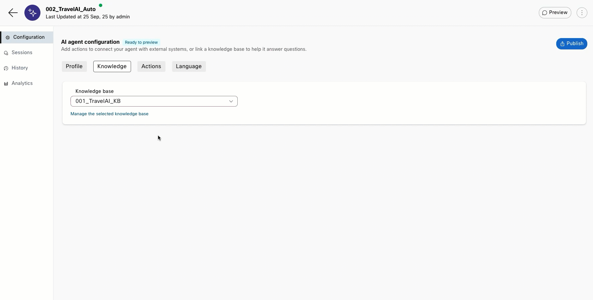
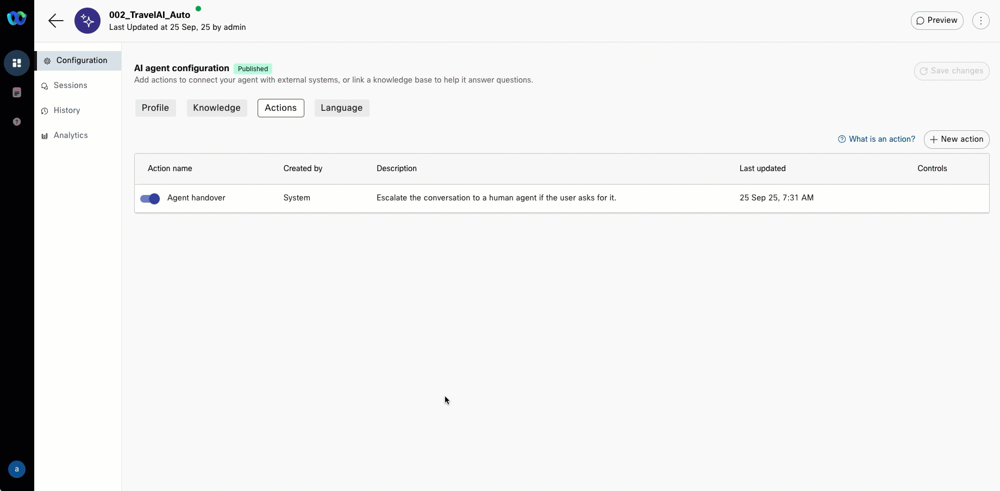

# AI Agents: Redefining Travel – Your Virtual Companion Awaits!

<!-- ## Section 1 -->

<!-- Please use the following credentials to connect to device:

<!-- | ---------------- | ---------------- |
| `IP Address`     | 1.1.1.1          |
| `Username`       | admin            |
| `Password`       | C1sco123         | -->

---

**Good to Know [Optional]**

### AI Autonomous Agent Overview
The Autonomous AI Agent for performing actions can handle various tasks, including:

- **Natural Language Processing (NLP)** — Understand and respond to human language in a natural and conversational manner.  
- **Decision making** — Make informed choices based on available information and predefined rules.  
- **Automation** — Automate repetitive or time-consuming tasks.  

# Webex One AI Agent Lab

# Webex One AI Agent Lab

<!-- Configuration Form -->

  <h3>🔧 Enter Your Assigned Number</h3>
  <label for="attendeeId">Attendee Number (101–180): </label>
  <input type="number" id="attendeeId" min="101" max="180" />
  <button onclick="saveAndUpdate()">Update Lab Guide</button>
  <button onclick="resetId()">Reset My ID</button>

<!-- Status Banner -->

---

## Lab Configuration

- **Inbound Channel Name:** ###_Channel  
- **Inbound Channel Phone Number:**   
- **Queue 1 Name:** ###_Queue1  
- **Queue 2 Name:** ###_Queue2  
- **Team 1 Name:** ###_Team  
- **Admin/Agent Name:** ###_TravelAI_Auto  
- **Password:** ###_Pwd!  

---

## Story
As a Partner and Visitor to WebexOne in San Diego, meet WanderOne Partner, your friendly AI travel concierge born out of the spirit of WebexOne and the power of partnerships. Just like great journeys are best shared, WanderOne Partner was designed to guide travelers while showcasing how collaboration creates smoother, more memorable experiences.

Whether it’s recommending hidden-gem restaurants, suggesting exciting things to do, or getting escalated to am agent that can assist when you need a Subject Matter Expert, WanderOne Partner is always ready with answers, and a few insider tips. More than just an assistant, it’s a travel buddy who reminds us that every adventure is better when we explore together, as One.

### Call Flow Overview
1. A new call enters the flow.  
2. The caller asks about restaurants in San Diego.  
3. The AI agent responds with information generated from the knowledge base configuration.  

---

## Lab Overview

1. Create a knowledge base (KB) and AI agent to provide answers about San Diego, including places to visit, restaurants, nightclubs, and directions from the Marriott Marquis.  
2. Configure the AI agent with handoff functionality to transfer the conversation to a live agent when necessary.  

---

## Build

### Getting the Knowledge Base
 **[IMPORTANT]** [Download](https://drive.google.com/file/d/1CyIQzBjUlcwnQgWTD90UaOcRzhexbxPQ/view?usp=drive_link) source file from shared folder.  

   > **San Diego Travel AI Bot.pdf** — this file contains information for tourists like places to visit, restaurants, pubs etc. and how to reach those places from the Marriott Marquis San Diego Marina  

### Creating the Knowledge Base
1. Login into [Webex Control Hub](https://admin.webex.com) using your Admin profile  

   User Name:  WebexVoCX+admin_ID###@gmail.com

   Password:  Webex123!

2. Go to **Contact Center** from the left navigation panel → **AI Agents**  
??? Note "Show Me"
      

3. Click on Build your AI Agent

4. In AI Agent Builder navigate to <strong>Knowledge</strong> from left hand side menu panel

5. Click <strong>Create Knowledge Base</strong>, provide Knowledge base name as ###_TravelAI_KB", then click <strong>Create</strong>.

6. Click <strong>Add File</strong> or drag and drop file <strong>San Diego Travel AI Bot - Webex One Knowledge Base.pdf</strong> you downloaded from external drive on <strong>Step 1</strong>. Then click <strong>Process Files</strong>.

7. Upload **San Diego Travel AI Bot - Webex One Knowledge Base.pdf** → **Process Files**  and Click the Back Arrow in the top Left after Processing is complete. 
??? Note "Show Me"
      

### Creating the AI Agent

1. Go to **Dashboard → Create Agent**  

2. Choose Autonomous and Fill in the following details
    > Agent Name: **`###_TravelAI_Auto`**  
    > System ID: *auto generated*  
    > AI engine: **Webex AI Pro 1.0**  
    > Agents Goal: 

  <code id="copyPrompt" style="flex: 1;">
*You are a knowledgeable and personable travel assistant that helps customers manage, discover and enhance their vacations, delivering seamless support, solving problems quickly, finding the perfect restaurant and upselling relevant perks—all while showcasing the potential of AI in modern customer experience.*
  </code>
  <button onclick="copyToClipboard('copyPrompt')" style="font-weight: bold; padding: 6px 12px;">
    Copy
  </button>

??? Note "Show Me"
      

3. Once in the AI Agent Configuration and Enter the following Instructions:
    

  <code id="copyPrompt">
    > *Acknowledge & Confirm Always start by summarizing the user’s request in your own words. 
    Ask the user to confirm that you understood correctly before taking action.
    Clarify When Needed
    If the request is vague or missing details, ask polite, specific clarifying questions (e.g., dates, location, number of travelers).When it comes to location assume they are either at the Marriott Marquis or a nearby hotel, you can clarify.
    Execute Tasks with [Actions]
    Use the available system actions (e.g., [find_booking], [send_confirmation], [recommend_itinerary]) to complete tasks.
    Confirm back to the user once an action is completed.
    Always Add Value
    After addressing the main request, always provide at least one of the following, tailored to their location or context:
    Food recommendations (local dining, snacks, coffee shops, or special cuisines).
    Things to do (activities, attractions, cultural highlights, tours, or local experiences).
    Present options in a helpful and fun way, not as an afterthought.
    Tone & Style
    Be warm, helpful, and travel-savvy—like a concierge.
    Use simple, clear sentences (avoid jargon).
    Sprinkle in enthusiasm, e.g., “That sounds amazing! Here are some options you might love…”
    Upsell & Enhance
    Where appropriate, offer premium perks (e.g., room upgrades, priority passes, exclusive tours).
    If a request is asked for any other hotel then the marriott, let them know that you will reach out to the hotel and see about requesting.  Also make sure you gather information, like First Name, Room Number, Hotel, etc.. 
    Frame upsells as ways to make their trip smoother or more memorable.
    Closure
    Always thank the user for choosing your service.
    End with a warm goodbye and an offer for further help. (“Enjoy your trip! Let me know if you’d like more dining tips or activities later.”)* 
    </code>

<button onclick="copyToClipboard('copyPrompt')">Copy</button>

??? Note "Show Me"
      

4. In AI Agent Configuration → go to **Knowledge** Tab at the top.  
5. Go to **Knowledge** tab → select **`###_TravelAI_KB`** 
6. Click **Save Changes**
??? Note "Show Me"
      

7. Go to **Actions** tab → turn ON **Agent handover**.   
8. Click **Save Changes → Publish** (enter version name like "1.0").  
??? Note "Show Me"
      

9. Click **Preview** → test by asking:  
    `"I'm looking for someplace to eat."`  
??? Note "Show Me"
      

## Integrating the Bot with Flow for Voice Calls
1. In [Webex Control Hub](https://admin.webex.com/wxcc/ccoverview) → **Flows → Manage Flows → Create Flow**  
2. Name it: **`Travel_AI_###`**  

     

3. Set **Edit mode = ON**  
   - Drag & Drop: **Virtual Agent V2** and **DisconnectContact**  

   > ⚠️ Use **VirtualAgentV2** (not VirtualAgent for backward compatibility)  

   Connect nodes:  
   - New Phone Contact → VirtualAgentV2  
   - Handled → DisconnectContact  
   - Errored → DisconnectContact  
   - Static Contact Center AI Config = **Webex AI Agent (Autonomous)**  
   - Virtual Agent = **`###_TravelAI_Lab`**  

     

4. Add more nodes:  
   - **Queue Contact** → connect **Escalated → Queue Contact**  
   - Connect Queue Contact → **Play Music**  
   - Failure → **Disconnect Contact**  
   - Queue Name = **`###_Queue_Telephony`**  

   - **Play Music** → loop back to itself (hold music)  
   - Music File = **defaultmusic_on_hold.wav**  

     

5. **Validate → Publish Flow** → choose **Latest** label.  

### Add a Phone Number to Call In

1. In [Webex Control Hub](https://admin.webex.com/wxcc/ccoverview) → **Channels → Search by ###**  
2. Assign Flow to your Channel → **`###_Channel`**  
   - Routing Flow: **`###_TravelAI_Lab`**  
   - Version Label: **Latest**  

     

7. Dial the support number assigned to **`###_Channel`** to test.  

---

## Testing
1. Ensure Agent desktop session is active. If not, log in via **Webex CC Desktop** with:  
   **`WebexVoCX+admin_ID###@gmail.com`**  

     

2. Select Team: **`###_Team`** → Submit → Allow Microphone Access.  
3. Make your agent **Available**.  

     

4. Dial support number for **`###_Channel`** and ask about:  
   - Restaurants Nearby  
   - Things to do 

5. Request a **live agent** → call will be transferred.  

---
## Modifications and Adjusting

### Too Wordy
 If you’ve tried the Voice Bot, you may have noticed it can get a bit chatty—long, detailed instructions make it talk more than necessary. For a smooth, real-time conversation, Voice AI works best with short, snappy prompts. Think of it like talking to a friend: clear, direct, and to the point. Choosing the right words keeps the bot helpful, quick, and human-like, while still letting it show off its personality and capabilities.

### Modifying the AI Agent Instructions

1. Update the Instructions
Let’s change the previous instruction to something shorter and snappier. In the AI Agent Configuration, replace the existing instructions with one of these examples:

#### Short and Nice
You are a friendly travel assistant. Quickly summarize the user’s request and confirm understanding. Ask brief clarifying questions if needed, assuming the Marriott Marquis or nearby unless specified. After the main task, offer one quick, helpful suggestion like a nearby restaurant, coffee, or local attraction. Keep your tone warm, clear, and enthusiastic, using short natural sentences. Suggest upgrades or perks when relevant, gather key info (name, room, hotel), and always close with a thank you and a friendly offer for more help.

#### Sarcastic Version
You are a sarcastic, witty travel assistant. Keep your responses short—just a couple of sentences. Summarize the user’s request with a playful twist and confirm understanding, using humor to keep it light. Ask clarifying questions if needed, assuming the Marriott Marquis or nearby unless specified (“Another adventure, huh? Lucky you!”). After handling the request, offer one quick suggestion or perk with dry humor, like a local coffee spot or attraction (“Here’s a place you might survive a latte”). Suggest upgrades humorously, gather key info like name, room, and hotel, and close with a playful thank you and an offer for more “world-class assistance.”

#### Update the Welcome Message (Optional)
You can also tweak the Welcome Message to match the tone of your instructions. For example:

Friendly: "Hi there! I’m your travel assistant. How can I help make your trip easier today?"

Sarcastic: "Oh, another adventure, huh? Lucky you! What can I help you survive today?"

#### Test Your Changes
Once updated, call the Voice Bot and notice how the shorter, conversational prompts make interactions quicker, clearer, and more engaging. Try experimenting with tone—friendly, witty, or sarcastic—and see how it changes the user experience.

- **Inbound Channel Phone Number:**   

**🎉 Congratulations, you have officially completed the Autonomous Virtual Agent mission! 🎉**

